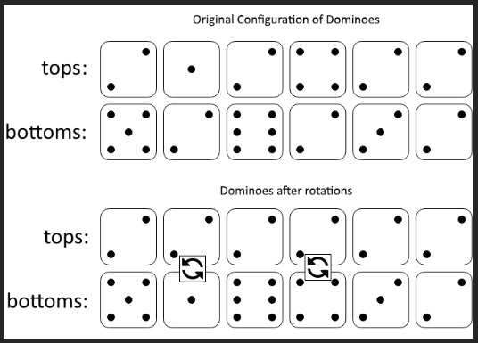

# Google Online Assessment Questions

A curated collection of Google's Online Assessment Questions, categorized by difficulty and type. Explore problems, descriptions, and solutions for coding challenges used in Google's assessments.

## Problem List

### New Grad

- 🌟 **Min Amplitude:** Calculate and minimize the amplitude of an array.
- 🌟 **Ways to Split String:** Count unique ways to split a string into prime numbers.
- 🌈 **Minimum Domino Rotations For Equal Row:** Determine the minimum rotations needed to make rows of dominoes equal.
- 🌈 **Time to Type a String:** Calculate the time to type a string using a keyboard.

### Intern

- ⭐⭐⭐ **Maximum Time:** Find the maximum time in a 24-hour format.
- 🟡 **Min Abs Difference of Server Loads:** Minimize the absolute difference of server loads.
- ⭐⭐⭐ **Most Booked Hotel Room:** Find the most booked hotel room based on log entries.
- ⭐ **Minimum Domino Rotations For Equal Row:** Determine the minimum rotations needed to make rows of dominoes equal.
- 🟡 **Time to Type a String:** Calculate the time to type a string using a keyboard.
- 🌐 **Maximum Level Sum of a Binary Tree:** Find the maximum level sum of a binary tree.
- 🌐 **Min Number of Chairs:** Calculate the minimum number of chairs needed for an event.
- 🌐 **K Closest Points to Origin:** Find the K closest points to the origin in a 2D plane.
- 🌐 **Odd Even Jump:** Determine if you can reach the end of an array using odd and even jumps.
- 🌐 **License Key Formatting:** Format a license key string.
- 🌐 **Unique Email Addresses:** Count the number of unique email addresses.
- 🍇 **Fruit Into Baskets:** Maximize the number of fruits in two baskets.
- 🍇 **Min Days to Bloom:** Calculate the minimum days needed for flowers to bloom.
- 🍇 **Fill Matrix:** Fill a matrix with values in spiral order.
- 🍇 **Decreasing Subsequences:** Count the number of decreasing subsequences.
- 🍇 **Max Distance:** Find the maximum distance between two numbers.
- 🍇 **Stores and Houses:** Determine the minimum distance between stores and houses.

# Min Amplitude

## Question 1:
Given an Array A, find the minimum amplitude you can get after changing up to 3 elements. Amplitude is the range of the array (basically the difference between the largest and smallest element).

### Example 1:
Input: [-1, 3, -1, 8, 5, 4]  
Output: 2  
Explanation: We can change -1, -1, 8 to 3, 4, or 5.  

### Example 2:

Input: [10, 10, 3, 4, 10]  
Output: 0  
Explanation: Change 3 and 4 to 10.  

## Question 2:
Given a string S, we can split S into 2 strings: S1 and S2. Return the number of ways S can be split such that the number of unique characters between S1 and S2 are the same.

### Example 1:
Input: "aaaa"    
Output: 3   
Explanation: We can get a - aaa, aa - aa, aaa - a.   

### Example 2:
Input: "bac"   
Output: 0   

### Example 3:
Input: "ababa"   
Output: 2   
Explanation: ab - aba, aba - ba.    

# Min Amplitude & Ways to Split String

## Question 1:
Given an Array A, find the minimum amplitude you can get after changing up to 3 elements. Amplitude is the range of the array (basically the difference between the largest and smallest element).

### Example 1:

Input: [-1, 3, -1, 8, 5, 4]    
Output: 2    
Explanation: We can change -1, -1, 8 to 3, 4, or 5.    

### Example 2:

Input: [10, 10, 3, 4, 10]     
Output: 0    
Explanation: Change 3 and 4 to 10.    

## Question 2:
Given a string S, we can split S into 2 strings: S1 and S2. Return the number of ways S can be split such that the number of unique characters between S1 and S2 are the same.

### Example 1:
Input: "aaaa"    
Output: 3    
Explanation: We can get a - aaa, aa - aa, aaa - a.    

### Example 2:
Input: "bac"    
Output: 0    

### Example 3:
Input: "ababa"   
Output: 2   
Explanation: ab - aba, aba - ba.   

# Maximize Time String

You are given a string that represents time in the format hh:mm. Some of the digits are blank (represented by ?). Fill in ? such that the time represented by this string is the maximum possible. Maximum time: 23:59, minimum time: 00:00. You can assume that input string is always valid.

### Example 1:
Input: "?4:5?"    
Output: "14:59"    

### Example 2:
Input: "23:5?"  
Output: "23:59"  

### Example 3:
Input: "2?:22"  
Output: "23:22"  

### Example 4:
Input: "0?:??"  
Output: "09:59"  

### Example 5:
Input: "??:??"  
Output: "23:59"  

# Server Load Balancing

There are some processes that need to be executed. The amount of load that a process causes on a server is represented by a single integer. The total load caused on a server is the sum of the loads of all the processes that run on that server. You have at your disposal two servers, on which the mentioned processes can be run. Your goal is to distribute the given processes between those two servers in a way that the absolute difference of their loads will be minimized.

### Problem Description

Given an array of `n` integers, where each integer represents the load caused by successive processes, return the minimum absolute difference of server loads.

### Example

Input:[1, 2, 3, 4, 5]  

Output:  
1   
### Explanation:
We can distribute the processes with loads `[1, 2, 4]` to the first server and `[3, 5]` to the second one so that their total loads will be 7 and 8, respectively. The difference of their loads will be equal to 1.

# Hotel Booking System

Given a hotel which has 10 floors [0-9] and each floor has 26 rooms [A-Z]. You are given a sequence of rooms, where `+` suggests the room is booked, and `-` suggests the room is freed. The task is to find which room is booked the maximum number of times.

## Problem Statement

You may assume that the list describes a correct sequence of bookings in chronological order. That is, only free rooms can be booked, and only booked rooms can be freed. All rooms are initially free. Note that this does not mean that all rooms have to be free at the end. In case two rooms have been booked the same number of times, return the lexographically smaller room.

## Assumptions

- N (length of input) is an integer within the range [1, 600].  
- Each element of array A is a string consisting of three characters: "+" or "-"; a digit "0"-"9"; and uppercase English letter "A" - "Z".  
- The sequence is correct. That is, every booked room was previously free, and every freed room was previously booked.  

### Example

Input: ["+1A", "+3E", "-1A", "+4F", "+1A", "-3E"]  
Output: "1A"  
Explanation: Room 1A has been booked 2 times.  

# Minimum Domino Rotations For Equal Row

In a row of dominoes, `tops[i]` and `bottoms[i]` represent the top and bottom halves of the ith domino. (A domino is a tile with two numbers from 1 to 6 - one on each half of the tile.)

We may rotate the ith domino so that `tops[i]` and `bottoms[i]` swap values.

Return the minimum number of rotations so that all the values in tops are the same, or all the values in bottoms are the same. If it cannot be done, return -1.

## Example

### Example 1:

   

Input: tops = [2,1,2,4,2,2], bottoms = [5,2,6,2,3,2]   
Output: 2   
Explanation:    
The first figure represents the dominoes as given by tops and bottoms: before we do any rotations.   
If we rotate the second and fourth dominoes, we can make every value in the top row equal to 2, as indicated by the second figure.   

### Example 2:

Input: tops = [3,5,1,2,3], bottoms = [3,6,3,3,4]   
Output: -1   
Explanation:    
In this case, it is not possible to rotate the dominoes to make one row of values equal.   
 
## Constraints

- 2 <= tops.length <= 2 * 10^4   
- bottoms.length == tops.length   
- 1 <= tops[i], bottoms[i] <= 6   

# Single-Row Keyboard Typing

Imagine you have a special keyboard with all keys in a single row. The layout of characters on a keyboard is denoted by a string `keyboard` of length 26. Initially, your finger is at index 0. To type a character, you have to move your finger to the index of the desired character. The time taken to move your finger from index i to index j is `abs(j - i)`.

Given a string `keyboard` that describes the keyboard layout and a string `text`, return an integer denoting the time taken to type the string `text`.

## Example

### Example 1:

Input: keyboard = "abcdefghijklmnopqrstuvwxy", text = "cba"   
Output: 4  
#### Explanation:  
Initially, your finger is at index 0. First, you have to type 'c'. The time taken to type 'c' will be abs(2 - 0) = 2 because character 'c' is at index 2.  
The second character is 'b', and your finger is now at index 2. The time taken to type 'b' will be abs(1 - 2) = 1 because character 'b' is at index 1.  
The third character is 'a', and your finger is now at index 1. The time taken to type 'a' will be abs(0 - 1) = 1 because character 'a' is at index 0.  
The total time will therefore be 2 + 1 + 1 = 4.  

## Constraints
Length of keyboard will be equal to 26, and all lowercase letters will occur exactly once.  
The length of text is within the range [1..100,000].  
String text contains only lowercase letters [a-z].  

# 1161. Maximum Level Sum of a Binary Tree
[Practice here](https://leetcode.com/problems/maximum-level-sum-of-a-binary-tree/description/)

# Minimum Number of Chairs Needed

There are n guests who are invited to a party. The k-th guest will attend the party at time S[k] and leave the party at time E[k].

Given an integer array S and an integer array E, both of length n, return an integer denoting the minimum number of chairs you need such that everyone attending the party can sit down.

## Example

### Example:

Input: S = [1, 2, 6, 5, 3], E = [5, 5, 7, 6, 8]   
Output: 3   
#### Explanation:
There are five guests attending the party.    
- The 1st guest will arrive at time 1. We need one chair at time 1.   
- The 2nd guest will arrive at time 2. There are now two guests at the party, so we need two chairs at time 2.   
- The 5th guest will arrive at time 3. There are now three guests at the party, so we need three chairs at time 3.   
- The 4th guest will arrive at time 5, and at the same moment, the 1st and 2nd guests will leave the party.   
  There are now two (the 4th and 5th) guests at the party, so we need two chairs at time 5.   
- The 3rd guest will arrive at time 6, and the 4th guest will leave the party at the same time.  
  There are now two (the 3rd and 5th) guests at the party, so we need two chairs at time 6.    
So we need at least 3 chairs.   

# 973. K Closest Points to Origin
[Practice here](https://leetcode.com/problems/k-closest-points-to-origin/description/)

# 975. Odd Even Jump
[Practice here](https://leetcode.com/problems/odd-even-jump/description/)

# 482. License Key Formatting
[Practice here](https://leetcode.com/problems/license-key-formatting/description/)

# 929. Unique Email Addresses
[Practice here](https://leetcode.com/problems/unique-email-addresses/description/)

# 904. Fruit Into Baskets
[Practice here](https://leetcode.com/problems/fruit-into-baskets/description/)

# Minimum Days to Get N Bouquets

Given an array of roses, where `roses[i]` means rose i will bloom on day `roses[i]`. Also given an int k, which is the minimum number of adjacent bloom roses required for a bouquet, and an int n, which is the number of bouquets we need. Return the earliest day that we can get n bouquets of roses.

## Example

### Example:

Input: roses = [1, 2, 4, 9, 3, 4, 1], k = 2, n = 2  
Output: 4  
#### Explanation:
day 1: [b, n, n, n, n, n, b]  
The first and the last rose bloom.  

day 2: [b, b, n, n, n, n, b]  
The second rose blooms. Here the first two bloom roses make a bouquet.  

day 3: [b, b, n, n, b, n, b]  

day 4: [b, b, b, n, b, b, b]  

See Here the last three bloom roses make a bouquet, meeting the required n = 2 bouquets of bloom roses. So return day 4.  

int minDaysBloom(int[] roses, int k, int n) {  
    // Implementation goes here  
    // ...
    return -1; // Placeholder  
}  

# Magic Square

Given a NxN matrix, fill the integers from 1 to n*n into this matrix in a way that makes the sum of each row, each column, and the two diagonals equal.

## Example

### Example 1:

Input: n = 2  
Output: null  
Explanation: We need to fill [1, 2, 3, 4] into a 2x2 matrix, which is not possible, so return null.  

### Example 2:
Input: n = 3   
Output:   
[[8, 3, 4],   
 [1, 5, 9],   
 [6, 7, 2]]   
#### Explanation: We need to fill [1, 2, 3... 9] into a 3x3 matrix. This is one way to do it.
Each row [8, 3, 4] [1, 5, 9] [6, 7, 2] sum is 15.   
Each column [8, 1, 6] [3, 5, 7] [4, 9, 2] sum is 15.   
The two diagonals [8, 5, 2] [4, 5, 6] sum is 15.   

int[][] fillMatrix(int n) {  
    // Implementation goes here  
    // ...  
    return new int[][]{}; // Placeholder  
}  

# Minimum Number of Subsequences

Given an int array `nums` of length n. Split it into strictly decreasing subsequences. Output the min number of subsequences you can get by splitting.

## Example

### Example 1:

Input: [5, 2, 4, 3, 1, 6]  
Output: 3  
#### Explanation:
You can split this array into: [5, 2, 1], [4, 3], [6]. And there are 3 subsequences you get.  
Or you can split it into [5, 4, 3], [2, 1], [6]. Also 3 subsequences.  
But [5, 4, 3, 2, 1], [6] is not legal because [5, 4, 3, 2, 1] is not a subsuquence of the original array.  

### Example 2:
Input: [2, 9, 12, 13, 4, 7, 6, 5, 10]  
Output: 4  
#### Explanation:
[2], [9, 4], [12, 10], [13, 7, 6, 5]

### Example 3:
Input: [1, 1, 1]  
Output: 3  
#### Explanation:
Because of the strictly descending order you have to split it into 3 subsequences: [1], [1], [1]

# Maximum Binary Distance

The distance between two binary strings is defined as the sum of their lengths after removing the common prefix. For example: the common prefix of `1011000` and `1011110` is `1011`, so the distance is `len("000") + len("110") = 3 + 3 = 6`.

Given a list of binary strings, the task is to pick a pair that gives you the maximum distance among all possible pairs and return that distance.

## Example

### Example:

binary_strings = ["1011000", "1011110", "1100110", "1111000"]    
max_distance = max_binary_distance(binary_strings)   
print(max_distance)  # Output: 6   

# Closest Stores

You are given two arrays representing integer locations of stores and houses (each location in this problem is one-dimensional). For each house, find the store closest to it.

Return an integer array `result` where `result[i]` should denote the location of the store closest to the i-th house. If many stores are equidistant from a particular house, choose the store with the smallest numerical location. Note that there may be multiple stores and houses at the same location.

## Example

### Example 1:
houses = [5, 10, 17]  
stores = [1, 5, 20, 11, 16]  
result = closest_stores(houses, stores)  
print(result)  # Output: [5, 11, 16]  

### Example 2:
houses = [2, 4, 2]   
stores = [5, 1, 2, 3]   
result = closest_stores(houses, stores)   
print(result)  # Output: [2, 3, 2]   

### Example 3:
houses = [4, 8, 1, 1]   
stores = [5, 3, 1, 2, 6]   
result = closest_stores(houses, stores)   
print(result)  # Output: [3, 6, 1, 1]   

